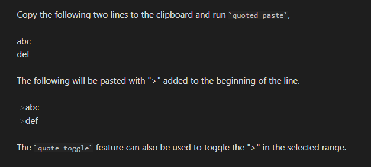
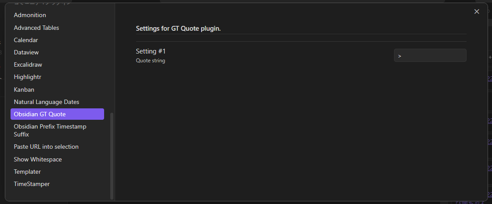
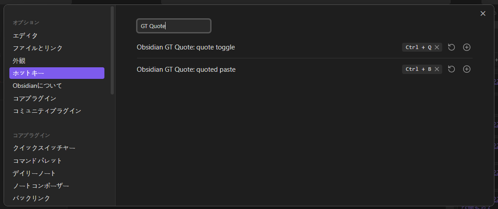

# GT Quote - Obsidian Plugin

This is a plugin to help with quote(>) operations.

- `quoted paste` : Paste text from the clipboard with a ">" appended to the beginning of the line.
- `quote toggle` : Appends a ">" or removes a ">" to the selected range on the note.

## Plugin Settings

You can change the quote string from ">".

## Hotkey Configuration

It is useful to set the function of this plugin to a hotkey.

- `quoted paste`
- `quote toggle`

